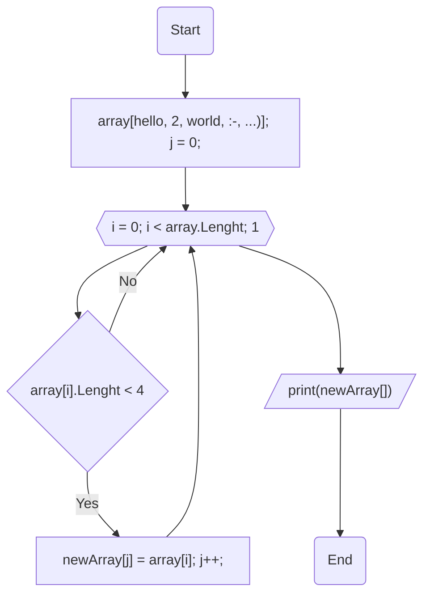

# FinalTestWork
## Программа, которая из существуещего массива строк формирует массив строк, длинна которых меньше или равна трем

* стр 2: задаем исходный массив строк
* стр 4 - 11: метод для вывода одномерного массива строк
* стр 13 - 24: метод для подсчета количества строк, длинна которых короче или равна трем
* стр 26 - 40: метод для создания нового массива строк и заполнения его строками, длинна которых короче или равна трем
* стр 42: присваиваем результат метода по посчету количества искомых строк переменной
* стр 44: вывод в консоль исходного массива
* стр 45: вывод в консоль массива заполненного искомыми строками

## Блок схема программы

